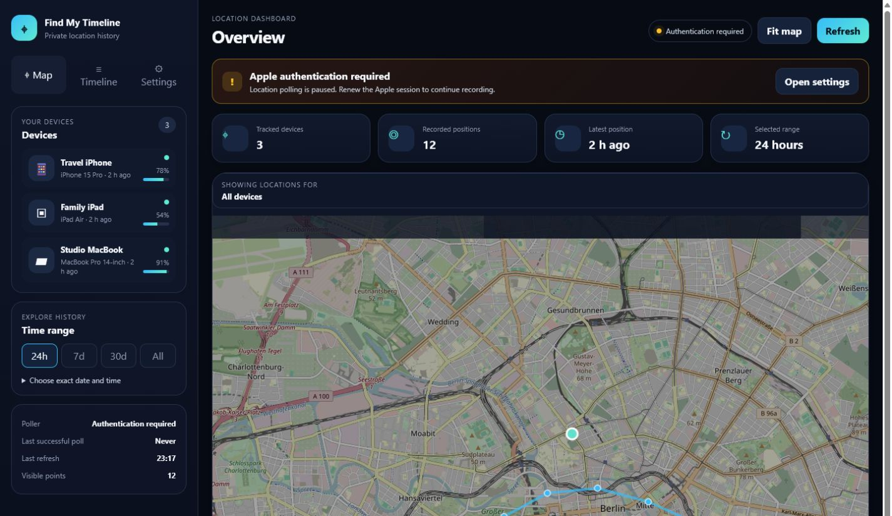
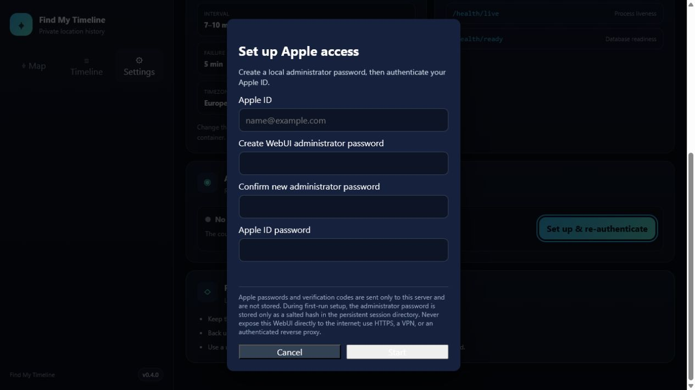
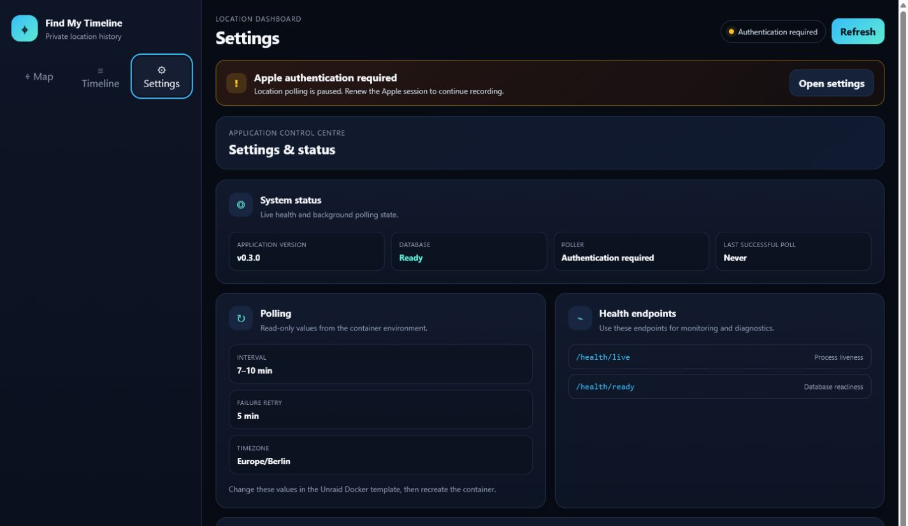

# Find My Timeline for Unraid

[](https://github.com/heckpiet/find-my-timeline-unraid/actions/workflows/ci.yml)
[](https://github.com/heckpiet/find-my-timeline-unraid/releases/latest)
[](https://github.com/heckpiet/find-my-timeline-unraid/pkgs/container/find-my-timeline-unraid)
[](LICENSE)

Self-hosted Apple Find My location history for Unraid. It records device positions in a local SQLite database and turns them into an interactive route map and chronological timeline.

**Current stable release:** `0.4.1` · **Image:** `ghcr.io/heckpiet/find-my-timeline-unraid:latest`

> Unofficial Unraid-focused fork. This project is not affiliated with or endorsed by Apple or Lime Technology.

## Screenshots

### Dashboard and route map



### Chronological timeline


### Guided Apple re-authentication



### Settings and system status



The screenshots use synthetic demonstration devices and locations; no production location history is included in the repository.

## What this project does

Apple's Find My interface normally focuses on the current or most recent device location. Find My Timeline polls the devices available through your Apple account at configurable intervals and stores those observations locally.

This makes it possible to review questions such as:

- Where was a device on a specific day and around a specific time?
- Which route did it take during the last 24 hours, seven days or 30 days?
- When was a device last seen and what battery level was reported?
- How many location records have been collected for each device?

The WebUI provides an interactive map, device selection, exact date and time filters, route lines, individual location points and a chronological timeline.

## Main features

- Unraid Community Applications template
- public and versioned Docker images through GitHub Container Registry
- persistent SQLite location database
- persistent Apple session and cookie storage
- configurable polling intervals
- responsive desktop and mobile WebUI
- device cards, status metrics and exact date/time search
- Apple session-status card and estimated re-authentication countdown
- guided browser-based Apple 2FA and first-run administrator setup
- credential-free container startup with persistent WebUI Apple ID onboarding
- separate administrator password for authentication actions
- masked Apple ID display
- expiring in-memory authentication flow
- security-focused response headers
- Docker health check
- self-healing poller with visible operational status
- dedicated settings view with application version, health, polling and authentication status
- separate liveness and readiness health checks
- documented backup, update and reverse-proxy guidance

## Requirements

- Unraid OS 6.12 or newer
- Docker enabled on Unraid
- Apple ID with two-factor authentication
- at least one device available through Apple's Find My service
- internet access from the container
- persistent Unraid appdata storage

## Important privacy notice

Location history is highly sensitive personal data. This application stores location records locally, but anyone who can access the WebUI or the application data directories may be able to reconstruct device movements.

Do not expose the WebUI directly to the public internet. Use a trusted local network, WireGuard, Tailscale or an authenticated HTTPS reverse proxy.

## Quick start on Unraid

1. Install **Find My Timeline** through Community Applications.
2. Keep both persistent appdata paths enabled.
3. Open the WebUI on the configured host port, normally port `5000`.
4. Complete the recommended WebUI setup below.
5. Confirm that the poller resumes and devices appear.
6. Confirm that the container health status becomes `healthy`.

### Recommended WebUI authentication

1. Start the container and open the WebUI.
2. Select **Set up & re-authenticate**.
3. Enter the Apple ID email address.
4. Create and confirm a long, unique WebUI administrator password.
5. Enter the Apple ID password.
6. Enter the verification code shown on a trusted Apple device.
7. Confirm that the WebUI reports a successful session renewal and the poller resumes.

The Apple ID address is persisted in `/root/.find-my-timeline/apple-identity.json` only after successful authentication, so it survives container updates without appearing in the container environment. The administrator password is persisted as a salted PBKDF2 hash in `/root/.find-my-timeline/web-admin.json`; the plaintext password is never stored. Passwords shorter than 12 characters are accepted only after two explicit warnings and remain strongly discouraged. Existing installations using `ICLOUD_USERNAME` or `WEB_ADMIN_PASSWORD` remain supported.

When upgrading an existing installation, v0.4.0 copies a legacy `ICLOUD_USERNAME` value into the persistent identity file. After one successful v0.4.0 start, remove the old Apple ID and Apple password variables from the Unraid container configuration so future starts use only WebUI onboarding and the protected session mapping.

### CLI authentication fallback

Open the container console and run:

```bash
find-my-timeline auth
```

From the Unraid host you can also use:

```bash
docker exec -it find-my-timeline find-my-timeline auth
docker restart find-my-timeline
```

## Unraid installation details

The Community Applications template is available at:

```text
https://raw.githubusercontent.com/heckpiet/find-my-timeline-unraid/master/templates/find-my-timeline.xml
```

Recommended image for automatic updates:

```text
ghcr.io/heckpiet/find-my-timeline-unraid:latest
```

Pinned stable image:

```text
ghcr.io/heckpiet/find-my-timeline-unraid:0.4.1
```

### Required persistent paths

| Container path | Recommended Unraid path | Purpose |
|---|---|---|
| `/app/data` | `/mnt/user/appdata/find-my-timeline/data` | SQLite database containing device and location history |
| `/root/.find-my-timeline` | `/mnt/user/appdata/find-my-timeline/session` | Apple session, cookie files and authentication metadata |

Back up both directories. The database contains movement history and the session directory contains reusable Apple session material.

## Apple authentication and stored secrets

The WebUI displays the current authentication state and an estimated remaining session lifetime. The default estimate is 90 days, but Apple may invalidate a session earlier. A successful device poll is more authoritative than the countdown.

The Apple ID password and verification code entered through the WebUI are held only for the active authentication flow. They are not written to SQLite, identity metadata or authentication metadata. Apple session cookies and the non-secret Apple ID address remain stored in `/root/.find-my-timeline`.

Legacy Apple two-step authentication remains available through the CLI only.

## Configuration

| Variable | Default | Description |
|---|---:|---|
| `ICLOUD_USERNAME` | unset | Legacy optional Apple ID override; WebUI setup is recommended |
| `ICLOUD_PASSWORD` | unset | Legacy CLI override; WebUI entry is recommended because it is not persisted |
| `POLL_MIN_INTERVAL` | `7` | Minimum interval between Apple location requests in minutes |
| `POLL_MAX_INTERVAL` | `10` | Maximum interval between Apple location requests in minutes |
| `AUTH_RETRY_INTERVAL_MINUTES` | `5` | Retry delay after Apple authentication or polling failures |
| `DATABASE_PATH` | `/app/data/locations.db` | SQLite database path |
| `WEB_HOST` | `0.0.0.0` | Web server binding inside the container |
| `WEB_PORT` | `5000` | Internal WebUI port |
| `WEB_AUTH_DISABLED` | `false` | Explicitly disables browser-based Apple re-authentication |
| `WEB_ADMIN_PASSWORD` | unset | Optional environment-managed administrator password; otherwise use first-run setup |
| `AUTH_SESSION_LIFETIME_DAYS` | `90` | Estimated Apple session lifetime used by the countdown |
| `WEB_AUTH_FLOW_TIMEOUT_SECONDS` | `600` | Maximum time between starting authentication and entering the verification code |
| `TZ` | `Europe/Berlin` | Container timezone in the Unraid template |

The minimum polling interval must not be greater than the maximum polling interval.

## Poller and health status

The dashboard reports whether the background poller is running, authenticating or waiting for authentication, together with the last successful poll. A failed Apple login no longer terminates the poller permanently. It retries after `AUTH_RETRY_INTERVAL_MINUTES`, and a successful WebUI re-authentication wakes it immediately.

The container exposes two lightweight health endpoints:

- `GET /health/live` confirms that the web process is responding.
- `GET /health/ready` confirms that SQLite is available.

`GET /api/system/status` provides the database and poller state without returning device locations.

## Security model

The configured or first-run administrator password protects only the endpoints that start and complete Apple authentication. It does not protect the location map, device list or location-history APIs.

Recommended deployment controls:

- keep the WebUI inside a trusted local network
- use WireGuard or Tailscale for remote access
- terminate HTTPS at a reverse proxy
- add authentication with Authelia, Authentik, OAuth2 Proxy or a comparable access layer
- use a unique administrator password with at least 20 random characters
- never reuse the Apple ID password as the WebUI administrator password
- leave `ICLOUD_PASSWORD` unset unless unattended recovery is more important than minimizing stored credentials
- restrict access to Unraid appdata and its backups

The application adds `X-Frame-Options`, `X-Content-Type-Options`, `Referrer-Policy` and `Cache-Control` response headers. Browser authentication requests expire after the configured timeout and require the administrator password on every write request.

## Updating on Unraid

The container uses persistent volumes, so replacing or updating the image should not remove the database or Apple session as long as both paths remain mapped correctly.

Before updating:

1. Back up `/app/data` and `/root/.find-my-timeline`.
2. Verify the existing path mappings.
3. Confirm that the container repository uses `ghcr.io/heckpiet/find-my-timeline-unraid:latest` for automatic updates, or a fixed version tag when pinning a release.
4. Apply the Docker update from Unraid.
5. Confirm that devices, historical locations and authentication status remain available.
6. Confirm that the container health status becomes `healthy`.

## Backup and restore

Back up these Unraid directories:

```text
/mnt/user/appdata/find-my-timeline/data
/mnt/user/appdata/find-my-timeline/session
```

To restore, stop the container, restore both directories to the same locations and start the container again. Protect backups because they contain sensitive movement history and reusable Apple session material.

## Docker usage outside Unraid

```bash
mkdir -p data session

docker run -d \
  --name find-my-timeline \
  --restart unless-stopped \
  -p 5000:5000 \
  -e POLL_MIN_INTERVAL=7 \
  -e POLL_MAX_INTERVAL=10 \
  -v "$(pwd)/data:/app/data" \
  -v "$(pwd)/session:/root/.find-my-timeline" \
  ghcr.io/heckpiet/find-my-timeline-unraid:latest
```

Open the WebUI at:

```text
http://your-server:5000
```

## Commands

| Command | Description |
|---|---|
| `find-my-timeline auth` | Authenticate with iCloud and handle interactive 2FA |
| `find-my-timeline poll` | Start location polling only |
| `find-my-timeline web` | Start the WebUI only |
| `find-my-timeline start` | Start polling and the WebUI |
| `find-my-timeline stats` | Show database statistics |
| `find-my-timeline devices` | List tracked devices |
| `find-my-timeline --version` | Show the installed application version |

## Troubleshooting

### No devices or locations appear

- confirm that the Apple account has devices available in Find My
- check that authentication completed successfully
- inspect the container logs for Apple login or polling errors
- confirm that `POLL_MIN_INTERVAL` is not greater than `POLL_MAX_INTERVAL`
- verify that the database directory is writable

### The countdown still shows time remaining, but polling fails

The countdown is an estimate based on the last successful authentication. Apple can invalidate sessions earlier. Check the dashboard poller status. Start a new authentication flow from the WebUI or use the CLI fallback; after successful WebUI authentication the poller retries immediately.

### Web authentication is unavailable

Confirm that:

```env
WEB_AUTH_DISABLED=false
```

Then restart the container. If no administrator password exists yet, the button reads **Set up & re-authenticate** and creates it during the successful Apple authentication flow.

### Authentication flow expired

Start the process again. The default browser authentication window is ten minutes and can be adjusted with `WEB_AUTH_FLOW_TIMEOUT_SECONDS`.

### Container is unhealthy

Check the container logs and verify that the WebUI is listening on port `5000`. The health check calls the local `/api/stats` endpoint.

## Validation status

The current `0.4.1` release is verified by the release pipeline before publication. CI covers repository privacy scanning, Python 3.10, 3.11 and 3.12, linting and formatting, tests with a 70% coverage threshold, built-wheel installation, the Unraid XML template, CodeQL analysis, and a credential-free rendered-WebUI container smoke test. Release builds publish one immutable multi-architecture image for `linux/amd64` and `linux/arm64`.

The optional, manually approved Unraid runner workflow uses temporary data and never mounts production appdata. The original end-to-end Unraid validation was performed on Unraid OS 7.3.2.

The 0.2.0 validation covered:

- public GHCR image pull
- installation through the Unraid Docker template
- persistent SQLite database storage
- persistent Apple session and cookie storage
- Apple two-factor authentication
- device discovery and location polling
- WebUI access on port 5000
- container restart and data persistence
- Docker health check

More details are available in [`docs/UNRAID_VALIDATION.md`](docs/UNRAID_VALIDATION.md).

## Development and CI

Create a virtual environment and run the same core checks used by CI:

```bash
python -m pip install -e '.[test]'
ruff check .
pytest
```

Pull requests run the privacy scan, Python test matrix, linting and formatting, package installation, CodeQL, template validation and a rendered-WebUI container smoke test. A version tag such as `v0.4.1` triggers the release pipeline, which verifies that the tag matches `pyproject.toml`, publishes the GHCR image and creates the GitHub release. Dependabot proposes grouped weekly dependency updates. See [`SECURITY.md`](SECURITY.md) for private reporting and [`RELEASING.md`](RELEASING.md) for the complete maintainer workflow.

## Support and contributions

Use the [GitHub issue tracker](https://github.com/heckpiet/find-my-timeline-unraid/issues) for Unraid packaging, Docker deployment and WebUI authentication problems. Include the Unraid version, container logs with secrets removed, the Docker image tag and clear reproduction steps.

Contributions are welcome. Keep changes focused, avoid logging secrets and include documentation for new environment variables or persistent data.

## License and attribution

The application remains licensed under the MIT License. Original copyright notices and attribution are retained in `LICENSE`.

## Original project reference

This repository is based on [kennym/find-my-timeline](https://github.com/kennym/find-my-timeline).

Original project description:

> Track historical location data from your Apple devices using the Find My service.
>
> Apple's Find My only shows current device locations. This tool polls your devices at random intervals and stores the history in a local database, letting you view location timelines on a map.
