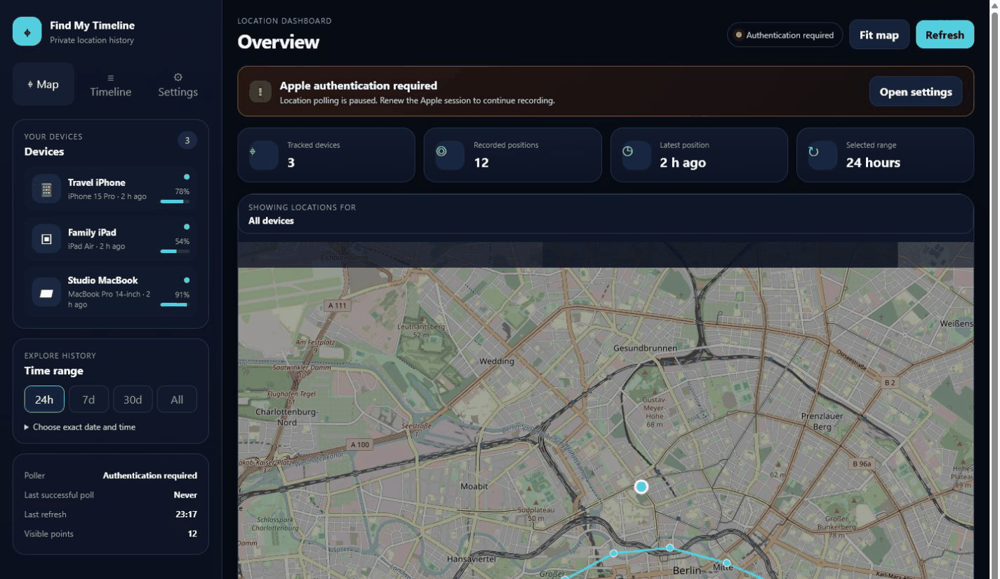
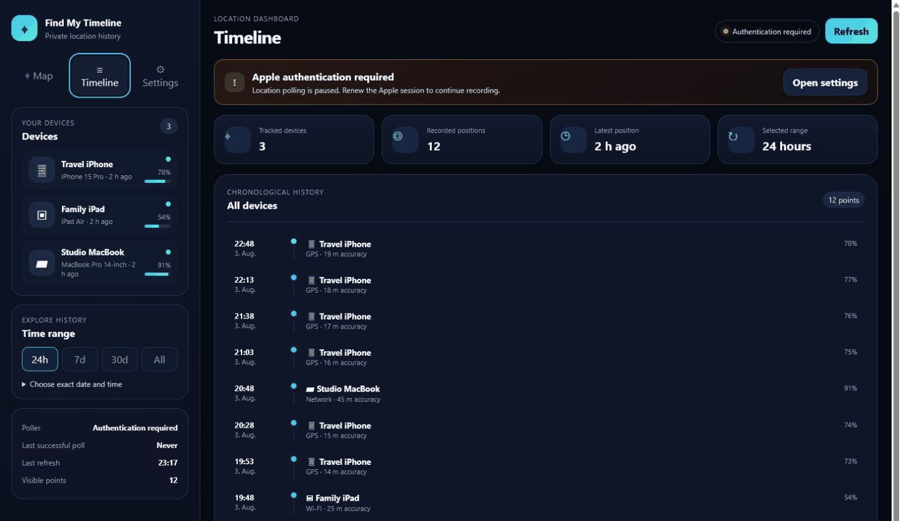
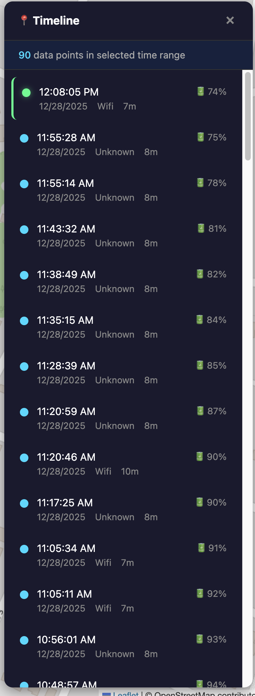

# Find My Timeline for Unraid

Self-hosted Apple Find My location history for Unraid, with an interactive timeline, local SQLite storage, Docker packaging and optional browser-based Apple re-authentication.

> Unofficial Unraid-focused fork. This project is not affiliated with or endorsed by Apple or Lime Technology.





## What this project does

Apple's Find My interface normally focuses on the current or most recent device location. Find My Timeline polls the devices available through your Apple account at configurable intervals and stores those observations locally.

This makes it possible to review questions such as:

- Where was a device on a specific day and around a specific time?
- Which route did it take during the last 24 hours, seven days or 30 days?
- When was a device last seen and what battery level was reported?
- How many location records have been collected for each device?

The WebUI provides an interactive map, device selection, time-range filters, route lines, individual location points and a chronological timeline.

## Highlights of this Unraid edition

- Unraid Community Applications template
- published Docker image through GitHub Container Registry
- persistent SQLite location database
- persistent Apple session and cookie storage
- configurable polling intervals
- WebUI session-status card
- estimated countdown until Apple re-authentication may be required
- optional browser-based Apple 2FA workflow
- separate administrator password for authentication actions
- masked Apple ID display
- expiring in-memory authentication flow
- security-focused response headers
- Docker health check
- documented backup, deployment and reverse-proxy guidance

## Important privacy notice

Location history is highly sensitive personal data. This application stores location records locally, but anyone who can access the WebUI or the application data directories may be able to reconstruct device movements.

Do not expose the WebUI directly to the public internet. Use a trusted local network, WireGuard, Tailscale or an authenticated HTTPS reverse proxy.

## Unraid installation

The application is prepared for Unraid Community Applications. Until it is published there, the template can be added manually:

```text
https://raw.githubusercontent.com/heckpiet/find-my-timeline-unraid/master/templates/find-my-timeline.xml
```

Docker image:

```text
ghcr.io/heckpiet/find-my-timeline-unraid:latest
```

### Required persistent paths

| Container path | Recommended Unraid path | Purpose |
|---|---|---|
| `/app/data` | `/mnt/user/appdata/find-my-timeline/data` | SQLite database containing location history |
| `/root/.find-my-timeline` | `/mnt/user/appdata/find-my-timeline/session` | Apple session, cookie files and non-secret authentication metadata |

Back up both directories. The database contains movement history and the session directory contains reusable Apple session material.

## Apple authentication

The WebUI displays the current authentication state and an estimated remaining session lifetime. The default estimate is 90 days, but Apple may invalidate a session earlier. A successful device poll is therefore more authoritative than the countdown.

### Recommended WebUI flow

1. Configure `ICLOUD_USERNAME`.
2. Set `WEB_AUTH_ENABLED=true`.
3. Set a long and unique `WEB_ADMIN_PASSWORD`.
4. Open the WebUI and select **Re-authenticate**.
5. Enter the WebUI administrator password and Apple ID password.
6. Enter the verification code shown on a trusted Apple device.
7. Confirm that the WebUI reports a successful session renewal.

The Apple ID password and verification code are held only for the active authentication flow. They are not written to SQLite or the authentication metadata file. Apple session cookies remain stored in `/root/.find-my-timeline`.

Legacy Apple two-step authentication remains available through the CLI only.

### CLI fallback

Inside the container:

```bash
find-my-timeline auth
```

From the Unraid host or another Docker host:

```bash
docker exec -it find-my-timeline find-my-timeline auth
docker restart find-my-timeline
```

## Configuration

| Variable | Default | Description |
|---|---:|---|
| `ICLOUD_USERNAME` | — | Apple ID email address |
| `ICLOUD_PASSWORD` | unset | Optional persistent password; leaving it unset reduces stored secrets |
| `POLL_MIN_INTERVAL` | `7` | Minimum interval between Apple location requests in minutes |
| `POLL_MAX_INTERVAL` | `10` | Maximum interval between Apple location requests in minutes |
| `DATABASE_PATH` | `/app/data/locations.db` | SQLite database path |
| `WEB_HOST` | `0.0.0.0` | Web server binding inside the container |
| `WEB_PORT` | `5000` | Internal WebUI port |
| `WEB_AUTH_ENABLED` | `false` | Enables browser-based Apple re-authentication |
| `WEB_ADMIN_PASSWORD` | unset | Protects the browser authentication endpoints |
| `AUTH_SESSION_LIFETIME_DAYS` | `90` | Estimated Apple session lifetime used by the countdown |
| `WEB_AUTH_FLOW_TIMEOUT_SECONDS` | `600` | Maximum time between starting authentication and entering the verification code |
| `TZ` | `Europe/Berlin` | Container timezone in the Unraid template |

## Security model

`WEB_ADMIN_PASSWORD` protects only the endpoints that start and complete Apple authentication. It does not protect the location map, device list or location-history APIs.

Recommended deployment controls:

- keep the WebUI inside a trusted local network
- use WireGuard or Tailscale for remote access
- terminate HTTPS at a reverse proxy
- add authentication with Authelia, Authentik, OAuth2 Proxy or a comparable access layer
- use a unique administrator password with at least 20 random characters
- never reuse the Apple ID password as the WebUI administrator password
- leave `ICLOUD_PASSWORD` unset unless unattended recovery is more important than minimizing stored credentials
- restrict access to Unraid appdata and its backups

The application adds `X-Frame-Options`, `X-Content-Type-Options`, `Referrer-Policy` and `Cache-Control` response headers. Browser authentication requests expire after the configured timeout and require the administrator password on every write request.

## Docker usage outside Unraid

```bash
mkdir -p data session

docker run -d \
  --name find-my-timeline \
  --restart unless-stopped \
  -p 5000:5000 \
  -e ICLOUD_USERNAME=your-apple-id@example.com \
  -e WEB_AUTH_ENABLED=true \
  -e WEB_ADMIN_PASSWORD='replace-with-a-long-random-password' \
  -e POLL_MIN_INTERVAL=7 \
  -e POLL_MAX_INTERVAL=10 \
  -v "$(pwd)/data:/app/data" \
  -v "$(pwd)/session:/root/.find-my-timeline" \
  ghcr.io/heckpiet/find-my-timeline-unraid:latest
```

Open the WebUI at:

```text
http://your-server:5000
```

## Commands

| Command | Description |
|---|---|
| `find-my-timeline auth` | Authenticate with iCloud and handle interactive 2FA |
| `find-my-timeline poll` | Start location polling only |
| `find-my-timeline web` | Start the WebUI only |
| `find-my-timeline start` | Start polling and the WebUI |
| `find-my-timeline stats` | Show database statistics |
| `find-my-timeline devices` | List tracked devices |

## Updating on Unraid

The container uses persistent volumes, so replacing or updating the image should not remove the database or Apple session as long as both paths remain mapped correctly.

Before updating:

1. Back up `/app/data` and `/root/.find-my-timeline`.
2. Verify the existing path mappings.
3. Pull the new image.
4. Recreate or update the container.
5. Confirm that devices, historical locations and authentication status remain available.

## Troubleshooting

### No devices or locations appear

- confirm that the Apple account has devices available in Find My
- check that authentication completed successfully
- inspect the container logs for Apple login or polling errors
- confirm that `POLL_MIN_INTERVAL` is not greater than `POLL_MAX_INTERVAL`
- verify that the database directory is writable

### The countdown still shows time remaining, but polling fails

The countdown is an estimate based on the last successful authentication. Apple can invalidate sessions earlier. Start a new authentication flow from the WebUI or use the CLI fallback.

### Web authentication is unavailable

Confirm that:

```env
WEB_AUTH_ENABLED=true
WEB_ADMIN_PASSWORD=your-long-random-password
```

Then restart the container.

### Authentication flow expired

Start the process again. The default browser authentication window is ten minutes and can be adjusted with `WEB_AUTH_FLOW_TIMEOUT_SECONDS`.

## Unraid Community Applications readiness

The repository includes:

- `templates/find-my-timeline.xml`
- `ca_profile.xml`
- application icon
- Dockerfile with health check and OCI metadata
- persistent path definitions
- masked password fields
- support, project and README links
- installation requirements and security warnings
- configurable timezone and polling intervals

Before final Community Applications submission:

1. Merge the prepared feature branch into `master`.
2. Confirm the Docker build workflow succeeds.
3. Set `ghcr.io/heckpiet/find-my-timeline-unraid` visibility to **Public**.
4. Pull and test the image on a real Unraid installation.
5. Confirm both persistent paths survive container updates.
6. Test initial authentication, re-authentication, invalid administrator credentials and an expired 2FA flow.
7. Validate and scan the repository through the Unraid Community Applications submission process.
8. Submit the repository for review.

## Support and contributions

Please use this repository's issue tracker for Unraid packaging, Docker deployment and WebUI authentication problems. Issues that also affect the upstream application should include enough detail to reproduce the problem independently of Unraid.

Contributions are welcome. Keep changes focused, avoid logging secrets and include documentation for new environment variables or persistent data.

## License and attribution

The application remains licensed under the MIT License. Original copyright notices and attribution are retained in `LICENSE`.

## Original project reference

This repository is based on [kennym/find-my-timeline](https://github.com/kennym/find-my-timeline).

Original project description:

> Track historical location data from your Apple devices using the Find My service.
>
> Apple's Find My only shows current device locations. This tool polls your devices at random intervals and stores the history in a local database, letting you view location timelines on a map.
